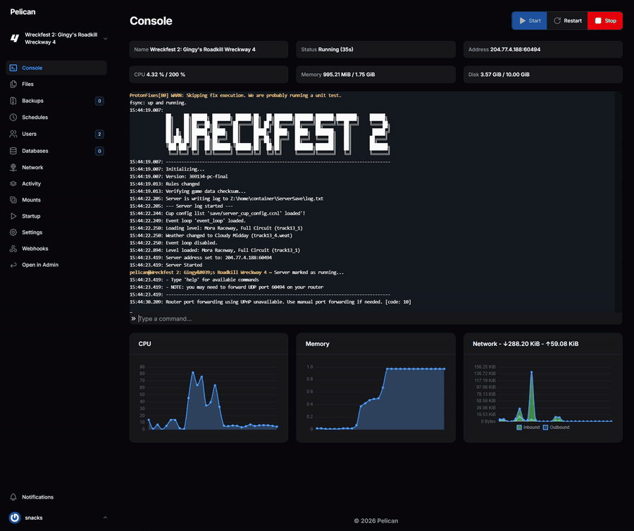

# [Wreckfest 2](https://wreckfest2.thqnordic.com/) Pelican/Pterodactyl Egg

This egg brings the Wreckfest 2 Dedicated Server to Linux via **[Proton](https://github.com/ValveSoftware/Proton)** on both **[Pelican Panel](https://github.com/pelican-dev/panel)** and **[Pterodactyl Panel](https://github.com/pterodactyl/panel)**, improving the overall self-hosting experience compared with running the server natively on Windows. It uses **[wreckfest-2-headless-server](https://github.com/olawton/wreckfest-2-headless-server)** to provide seamless, reliable command input and console output through either panel.

> [!NOTE]
>
> **Upgrading an existing server:** Importing the latest egg does not automatically update the startup command saved to servers that were created with an earlier release. After importing the updated egg, open each existing server’s **Startup** settings and reset its startup command to **Default**. Alternatively, update it manually to:
>
> ```shell
> proton run Wreckfest2-headless.exe --server --save-dir={{CONFIG_PATH}}
> ```
>
> This step is required only for existing servers; servers created from the latest egg will use the new command automatically.

<p align="center">
  
</p>

---

## Features

**Full Console Functionality** — View console output and send commands to the server via the panel\
**Log Archiving** — Archives and organizes the server logs in their own directory at server start

---

## Getting Started

1. **Download the Egg**  
   Grab the latest egg for either the Pelican Panel or Pterodactyl Panel from the **[eggs directory](https://github.com/olawton/wreckfest-2-egg/tree/main/eggs)**.

2. **Import the Egg**  
   Upload/import the egg into your panel as you would any other server template.

3. **Allocate a Port**  
   Add a port allocation to the node hosting your server.  
   - The default Wreckfest 2 server port is **30100**.

4. **Create the Server**  
   Create a new server using the imported egg and assign the port you just allocated.
   - Allocate **at least 2 GB of RAM**.  
   - Ensure the server **has access to swap memory**.

> [!NOTE]
>
> Without swap memory enabled, you’ll need to allocate significantly more RAM or restart the server more frequently to avoid crashes caused by a known memory leak.  

5. **Save Directory**  
   The server’s `save-dir` parameter is preconfigured to target the `ServerSave` directory. This is where the server writes:
   - `event_loop.becl`
   - `server_config.scnf`
   - `server_privilege.sprv`

---

## Suggestions

* Create a schedule in the panel to restart the server daily (a time during low server activity is recommended).
* Use Gingy's **[Wreckfest 2 Event Loop Builder](https://wreckevents.com/)** to quickly generate an event_loop.becl file for your server.
* For 24-player servers use a processor with a **[Geekbench 6](https://www.geekbench.com/)** single-core score of at least 1,750.

---

## Support

Have a question about the egg? **[Open an issue](https://github.com/olawton/wreckfest-2-egg/issues)**. Have a question about the Wreckfest 2 Dedicated Server? Use the #server-setup channel in the official **[Wreckfest Discord](https://discord.gg/W9cHf45UJB)**.
